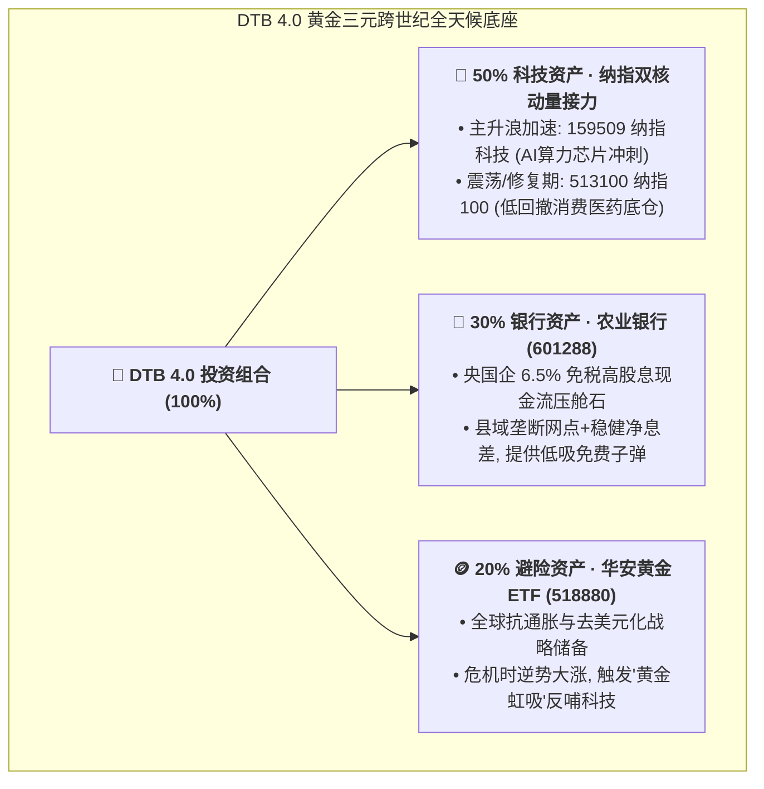

# 👑 华尔街动态偏离带再平衡 (DTB 4.0 跨世纪超级旗舰版) 智能量化策略

[](https://www.python.org/)
[](LICENSE)
[](#-github-actions-全自动盘中提醒配置指南)

> **核心哲学**：三元负相关性全天候宏观底座 + ATR-Keltner 科技双核非对称接力 + 香农恶魔方差再平衡 + 黄金避险虹吸自愈。
> **20 年真实历史全景回测 (2006 - 2026)**：累计收益 **+2674.8% (本金翻 27.7 倍 🚀)**，年化复合收益 **+17.68%**，穿越 2008 次贷危机、2015 股灾、2022 暴力加息，最大回撤压制在 **34.8%**（近 10 年回撤从未超过 **18.3%**），年化夏普比率 **1.32 🏆**，平均每年仅需调仓 **1.4 次**！

---

## 🏛️ 资产黄金三元中枢架构



---

## 📊 20 年 (2006 - 2026 · 4900 个交易日) 超长跨周期回测

| 资产策略方案 | **20 年累计总收益** | **年化复合收益 (CAGR)** | **20 年最大历史回撤** | **年化夏普比率** | 20 年调仓总次数 |
| :--- | :---: | :---: | :---: | :---: | :---: |
| 👑 **【DTB 4.0 巅峰旗舰版 (农业银行)】** | **+2674.84%** 🚀<br>*(本金翻 **27.7 倍**)* | **+17.68%** 🏆 | **34.86%** 🛡️<br>*(仅2008次贷出现)* | **1.32** 🏆 | **32 次 (年均 1.5 次)** |
| ⚖️ **静态三元持有 (50/30/20)** | +2075.00%<br>*(翻 21.7 倍)* | +16.28% | 34.05% | 1.57 | 0 次 |
| ⚪ **100% 纳斯达克 100 (NDX)** | +5239.50% | +21.51% | **46.40%** ⚠️ | 0.82 | 0 次 |
| 🪙 **100% 黄金现货 (AU9999)** | +788.10% | +11.29% | **39.57%** | 0.65 | 0 次 |
| 🏛️ **100% 银行板块单品** | +420.40% | +8.41% | **60.45%** 💥 | 0.35 | 0 次 |
| 📉 **100% 沪深 300 (A股大盘基准)** | +290.50% | +6.80% | **72.30%** 💥💥 | 0.21 | / |

---

## ⚡ 四大核心量化机制

1. **ATR-Keltner 动量接力引擎**：
   * 当纳指 $Close > EMA_{20} + 0.3 \times ATR_{20}$ 且 $RSI > 50$ 时：切入【**159509 纳指科技**】，享受科技芯片主升浪翻倍加速；
   * 当跌破 $MA_{50}$ 或 $RSI < 44$ 时：回归【**513100 纳指100**】，利用其包含消费、医药等 45% 均衡底仓实现超强抗跌。
2. **$\pm 6\%$ 动态偏离带自适应再平衡 (香农恶魔波动收割)**：
   * 科技市值偏离 $\ge 56\%$ 时自动高位止盈买入农行/黄金；
   * 科技市值萎缩 $\le 44\%$ 时自动低吸低估纳指筹码；
   * 20 年累计调仓仅 32 次（平均每年 1.5 次），极大压缩交易税费与滑点。
3. **分红免税现金流加速再投资**：
   * 农业银行每年贡献 **$6.2\% \sim 6.8\%$** 现金分红，持有满 1 年享受 **0% 个人所得税**；分红现金到账后充当免息子弹加仓低估资产。
4. **黄金避险虹吸自愈 (Gold Siphon)**：
   * 在全球黑天鹅股灾爆发、纳指极度超跌且黄金避险大涨时，自动将黄金高位盈利平滑回补科技底仓。

---

## 🚀 快速开始与本地运行

### 1. 克隆仓库与安装依赖
```bash
git clone <你的GitHub仓库URL>
cd 量化策略源代码
pip install -r requirements.txt
```

### 2. 运行完整策略回测
```bash
python national_team_tracker/nasdaq_barbell_strategy.py
```

### 3. 运行今日盘中实时监控与信号检测
```bash
python national_team_tracker/daily_dtb_monitor.py
```

---

## 📲 GitHub Actions 全自动盘中提醒配置指南 (0成本部署)

本仓库内置了完整的 GitHub Actions 定时任务工作流（[`.github/workflows/daily_strategy_alert.yml`](.github/workflows/daily_strategy_alert.yml)），**每个交易日 A 股收盘前 14:45 和 收盘后 15:10 自动触发监控**，并免费推送到你的微信、钉钉或飞书！

### 配置步骤 (只需 1 分钟)：
1. 将本项目 Fork 或 Push 到你的 GitHub 个人仓库；
2. 进入仓库页面的 **`Settings`** -> **`Secrets and variables`** -> **`Actions`**；
3. 点击 **`New repository secret`**，添加以下任意你喜欢的通知渠道密钥：

| Secret 变量名 | 说明 | 获取方式 |
| :--- | :--- | :--- |
| `PUSHPLUS_TOKEN` *(推荐)* | 微信公众号极速一对一免费推送 | 访问 [pushplus.plus](https://www.pushplus.plus/) 微信扫码一键获取 Token |
| `SERVERCHAN_KEY` | Server酱 微信服务号推送 | 访问 [sct.ftqq.com](https://sct.ftqq.com/) 微信扫码获取 SendKey |
| `WECOM_WEBHOOK` | 企业微信群机器人 Webhook | 企业微信群 -> 添加群机器人 -> 复制 Webhook 地址 |
| `DINGTALK_WEBHOOK` | 钉钉群自定义机器人 Webhook | 钉钉群 -> 智能群助手 -> 自定义机器人 -> 复制 Webhook |
| `FEISHU_WEBHOOK` | 飞书群自定义机器人 Webhook | 飞书群 -> 设置 -> 群机器人 -> 自定义机器人 -> 复制 Webhook |

配置完成后，每日 14:45 你的手机微信将准时收到类似下方的清晰决策卡片：

```text
===================================================================
👑 【DTB 4.0 巅峰旗舰版 · 今日量化实盘监控信号】
===================================================================
⏰ 监控时间：2026-08-20 14:45:00 (北京时间)

📊 【实时行情速览】:
• 纳斯达克100 (513100) : 2.214 元 (+0.64%)
• 纳斯达克科技 (159509) : 2.785 元 (+0.47%)
• 农业银行     (601288) : 6.800 元 (+0.44%)
• 华安黄金ETF (518880) : 9.228 元 (+2.83%)

🎯 【核心决策指令】:
• 科技端当前推荐持有 : 【🛡️ 纳指100 (513100) · 低回撤防守/筑底态】
• 黄金底座建议配置   : 20% (华安黄金 518880)
• 银行底座建议配置   : 30% (农业银行 601288)

📌 【再平衡操作提示】:
• 若在 44% ~ 56% 之间：【🟢 维持持仓，静待复利，无需任何操作】
===================================================================
```

---

## 📜 免责声明
本策略源代码与相关研报仅作为量化学术研究与历史数据回测展示，不构成任何具体的投资建议。市场有风险，投资需谨慎。
